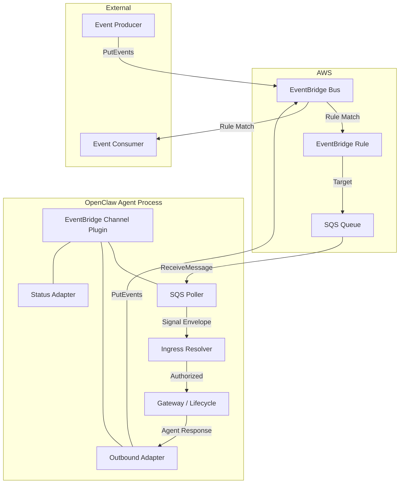
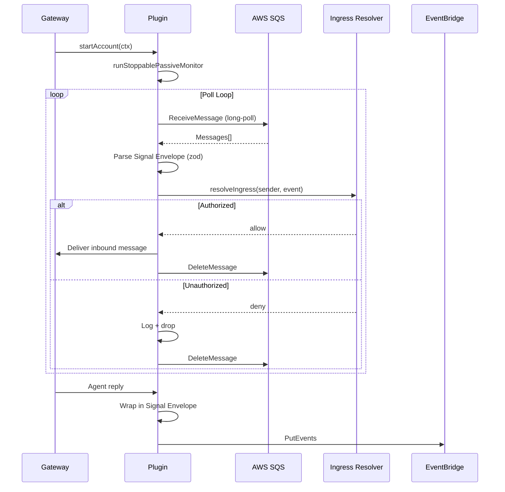

# Design Document: EventBridge Channel Plugin

## Overview

The EventBridge channel plugin enables OpenClaw agents to participate in AWS event-driven architectures as first-class signal processors. It provides a transport-only channel surface that:

- **Receives** structured events from an SQS queue (fed by EventBridge rules) via long-polling
- **Emits** agent responses as structured events onto an EventBridge bus via `PutEvents`
- **Validates** all event payloads against a typed Signal Envelope schema (zod)
- **Enforces** access control via the standard OpenClaw ingress resolver

The plugin follows the passive-account lifecycle pattern established by IRC/Signal/Matrix plugins, using `runStoppablePassiveMonitor` for clean start/stop semantics.

### Design Rationale

EventBridge was chosen over direct Lambda invocation or API Gateway webhooks because:
1. SQS-backed polling keeps the plugin's execution model identical to other connection-based channels (IRC, Matrix)
2. No inbound HTTP surface eliminates NAT/firewall/TLS certificate concerns
3. EventBridge rules handle filtering server-side, reducing plugin complexity
4. The fan-out model (one bus, many consumers) maps naturally to multi-agent coordination

## Architecture

### High-Level System Diagram



### Component Interaction Sequence



## Components and Interfaces

### File Layout

```
extensions/eventbridge/
├── openclaw.plugin.json          # Plugin manifest
├── package.json                  # Dependencies (@aws-sdk/client-sqs, client-eventbridge, credential-provider-node, zod)
├── index.ts                      # defineBundledChannelEntry(...)
├── channel-plugin-api.ts         # Re-exports eventbridgePlugin
├── runtime-api.ts                # Runtime injection barrel
├── api.ts                        # Public API barrel (exports Signal Envelope schema)
├── configured-state.ts           # hasConfiguredState check
├── tsconfig.json
├── src/
│   ├── channel.ts                # createChatChannelPlugin definition
│   ├── config-schema.ts          # Zod config schema (EventBridgeConfigSchema)
│   ├── config-schema.test.ts     # Config validation tests
│   ├── envelope.ts               # Signal Envelope schema + helpers
│   ├── envelope.test.ts          # Envelope round-trip + validation tests
│   ├── gateway.ts                # startEventBridgeGatewayAccount (lifecycle entry)
│   ├── poller.ts                 # SQS long-poll loop
│   ├── poller.test.ts            # Poller unit tests
│   ├── inbound.ts                # Inbound message processing + ingress
│   ├── inbound.test.ts           # Inbound behavior tests
│   ├── outbound.ts               # PutEvents outbound adapter
│   ├── outbound.test.ts          # Outbound tests
│   ├── probe.ts                  # SQS connectivity probe
│   ├── probe.test.ts             # Probe tests
│   ├── credentials.ts            # AWS credential chain factory
│   ├── backoff.ts                # Exponential backoff helper
│   ├── backoff.test.ts           # Backoff tests
│   ├── types.ts                  # Shared internal types
│   └── runtime.ts                # Runtime singleton accessor
```

### Component Contracts

#### 1. Plugin Entry (`index.ts`)

```typescript
import { defineBundledChannelEntry } from "openclaw/plugin-sdk/channel-entry-contract";

export default defineBundledChannelEntry({
  id: "eventbridge",
  name: "EventBridge",
  description: "AWS EventBridge channel plugin",
  importMetaUrl: import.meta.url,
  plugin: {
    specifier: "./channel-plugin-api.js",
    exportName: "eventbridgePlugin",
  },
  runtime: {
    specifier: "./runtime-api.js",
    exportName: "setEventBridgeRuntime",
  },
});
```

#### 2. Plugin Manifest (`openclaw.plugin.json`)

```json
{
  "id": "eventbridge",
  "activation": { "onStartup": false },
  "channels": ["eventbridge"],
  "channelEnvVars": {
    "eventbridge": ["EVENTBRIDGE_QUEUE_URL", "EVENTBRIDGE_BUS_NAME", "AWS_REGION"]
  },
  "configSchema": { "type": "object", "additionalProperties": false, "properties": {} }
}
```

#### 3. Configuration Schema (`src/config-schema.ts`)

```typescript
import { z } from "zod";
import {
  DmPolicySchema,
  buildChannelConfigSchema,
  requireOpenAllowFrom,
} from "openclaw/plugin-sdk/channel-config-schema";

export const EventBridgeConfigSchema = z.object({
  queueUrl: z.string().url(),
  busName: z.string().optional(),
  busArn: z.string().optional(),
  sourceNamespace: z.string().default("openclaw.agent"),
  region: z.string().optional(),
  pollIntervalMs: z.number().int().min(0).max(60_000).optional(),
  maxMessages: z.number().int().min(1).max(10).default(10),
  waitTimeSeconds: z.number().int().min(0).max(20).default(20),
  dmPolicy: DmPolicySchema.optional().default("allowlist"),
  allowFrom: z.array(z.string()).optional(),
}).strict().superRefine((value, ctx) => {
  requireOpenAllowFrom({
    policy: value.dmPolicy,
    allowFrom: value.allowFrom,
    ctx,
    path: ["allowFrom"],
    message: 'channels.eventbridge.dmPolicy="open" requires channels.eventbridge.allowFrom to include "*"',
  });
});

export const EventBridgeChannelConfigSchema = buildChannelConfigSchema(EventBridgeConfigSchema);
```

#### 4. Signal Envelope Schema (`src/envelope.ts`)

```typescript
import { z } from "zod";

export const SignalEnvelopeSchema = z.object({
  source: z.string().min(1),
  detailType: z.string().min(1),
  correlationId: z.string().uuid(),
  causationId: z.string().uuid().optional(),
  payload: z.record(z.string(), z.unknown()),
  metadata: z.record(z.string(), z.unknown()).optional(),
});

export type SignalEnvelope = z.infer<typeof SignalEnvelopeSchema>;

/** Wraps an outbound message into a Signal Envelope. Returns null if wrapping fails. */
export function wrapOutboundEnvelope(params: {
  source: string;
  detailType: string;
  correlationId: string;
  causationId?: string;
  payload: Record<string, unknown>;
  metadata?: Record<string, unknown>;
}): SignalEnvelope | null {
  const result = SignalEnvelopeSchema.safeParse(params);
  return result.success ? result.data : null;
}

/** Parses an inbound event body into a validated Signal Envelope. */
export function parseInboundEnvelope(raw: unknown): {
  ok: true; envelope: SignalEnvelope;
} | { ok: false; error: string } {
  const result = SignalEnvelopeSchema.safeParse(raw);
  if (result.success) {
    return { ok: true, envelope: result.data };
  }
  return { ok: false, error: result.error.message };
}
```

#### 5. SQS Poller (`src/poller.ts`)

```typescript
import { SQSClient, ReceiveMessageCommand, DeleteMessageCommand } from "@aws-sdk/client-sqs";

export type PollResult = {
  messageId: string;
  receiptHandle: string;
  body: unknown;
  approximateReceiveCount: number;
};

export type PollerConfig = {
  queueUrl: string;
  maxMessages: number;
  waitTimeSeconds: number;
  region?: string;
};

export type PollerCallbacks = {
  onMessages: (messages: PollResult[]) => Promise<void>;
  onError: (error: unknown) => void;
  statusSink?: (patch: { lastInboundAt?: number }) => void;
};

/**
 * Runs the SQS long-poll loop until abortSignal fires.
 * Retries with exponential backoff on transient errors.
 */
export async function runSqsPoller(params: {
  client: SQSClient;
  config: PollerConfig;
  callbacks: PollerCallbacks;
  abortSignal: AbortSignal;
}): Promise<void>;

/** Deletes a successfully-processed message from SQS. */
export async function deleteMessage(params: {
  client: SQSClient;
  queueUrl: string;
  receiptHandle: string;
}): Promise<void>;
```

**Algorithm — Poll Loop:**

```
while not abortSignal.aborted:
  try:
    response = SQS.ReceiveMessage(queueUrl, maxMessages, waitTimeSeconds)
    if response.Messages:
      parsed = response.Messages.map(parse body as JSON)
      await callbacks.onMessages(parsed)
      callbacks.statusSink({ lastInboundAt: now })
    resetBackoff()
  catch error:
    callbacks.onError(error)
    await sleep(backoff.next())
    if abortSignal.aborted: break
```

#### 6. Inbound Processing (`src/inbound.ts`)

```typescript
import { createChannelIngressResolver, defineStableChannelIngressIdentity }
  from "openclaw/plugin-sdk/channel-ingress-runtime";

export type InboundEventContext = {
  envelope: SignalEnvelope;
  sqsMessageId: string;
  receiptHandle: string;
};

/**
 * Processes a batch of inbound SQS messages:
 * 1. Parse each body as EventBridge event → extract Signal Envelope
 * 2. Validate envelope via zod
 * 3. Resolve ingress (access check via dmPolicy/allowFrom)
 * 4. If authorized → deliver to agent
 * 5. Delete processed message from SQS
 * 6. If invalid/unauthorized → log, delete (do not requeue)
 */
export async function handleInboundBatch(params: {
  messages: PollResult[];
  config: ResolvedEventBridgeConfig;
  runtime: RuntimeEnv;
  sqsClient: SQSClient;
  statusSink?: (patch: { lastInboundAt?: number }) => void;
}): Promise<void>;
```

**Ingress Identity:**

The ingress resolver uses the `source` field from the Signal Envelope as the sender identity:

```typescript
const eventbridgeIngressIdentity = defineStableChannelIngressIdentity({
  key: "eventbridge-source",
  normalizeEntry: (entry) => entry.trim().toLowerCase() || null,
  normalizeSubject: (subject) => subject.trim().toLowerCase(),
  sensitivity: "internal",
  isWildcardEntry: (entry) => entry.trim() === "*",
});
```

#### 7. Outbound Adapter (`src/outbound.ts`)

```typescript
import { EventBridgeClient, PutEventsCommand } from "@aws-sdk/client-eventbridge";

export type OutboundSendResult = {
  messageId: string;
  eventId?: string;
};

/**
 * sendText: Wraps text in Signal Envelope, calls PutEvents.
 * sendMedia: Wraps text + mediaUrl reference in Signal Envelope, calls PutEvents.
 */
export async function sendEventBridgeOutbound(params: {
  client: EventBridgeClient;
  busName?: string;
  source: string;
  detailType: string;
  correlationId: string;
  causationId?: string;
  payload: Record<string, unknown>;
  metadata?: Record<string, unknown>;
}): Promise<OutboundSendResult>;
```

The outbound adapter is registered via `createChatChannelPlugin` with:
- `deliveryMode: "direct"`
- `sendText`: wraps text in envelope → `PutEvents`
- `sendMedia`: wraps text + `mediaUrl` in envelope payload → `PutEvents`

On partial failure (`FailedEntryCount > 0`), the entire batch is re-sent once.

#### 8. Gateway Lifecycle (`src/gateway.ts`)

```typescript
import { runStoppablePassiveMonitor } from "openclaw/plugin-sdk/extension-shared";

export async function startEventBridgeGatewayAccount(ctx: {
  cfg: CoreConfig;
  accountId: string;
  runtime: RuntimeEnv;
  abortSignal: AbortSignal;
  setStatus: (next: ChannelAccountSnapshot) => void;
  log?: { info?: (msg: string) => void };
}): Promise<void> {
  // Validate config, build AWS clients, then:
  await runStoppablePassiveMonitor({
    abortSignal: ctx.abortSignal,
    start: async () => {
      // Start poller, return { stop } handle
      return await startEventBridgeMonitor({ ...ctx });
    },
  });
}
```

#### 9. Probe Adapter (`src/probe.ts`)

```typescript
export type EventBridgeProbe = {
  ok: boolean;
  queueUrl: string;
  error?: string;
  latencyMs?: number;
};

/** Sends a no-op ReceiveMessage with maxMessages=0 (or 1 with waitTimeSeconds=0) to verify SQS accessibility. */
export async function probeEventBridge(config: ResolvedEventBridgeConfig): Promise<EventBridgeProbe>;
```

#### 10. Backoff Helper (`src/backoff.ts`)

```typescript
export type BackoffState = {
  next: () => number;  // Returns delay in ms, advances state
  reset: () => void;   // Resets to initial delay
};

/** Creates exponential backoff: base 1s, max 30s, jitter ±20%. */
export function createExponentialBackoff(params?: {
  baseMs?: number;
  maxMs?: number;
  jitterFraction?: number;
}): BackoffState;
```

#### 11. Credentials (`src/credentials.ts`)

```typescript
import { fromNodeProviderChain } from "@aws-sdk/credential-provider-node";

/** Builds AWS credential provider using the standard Node chain. */
export function buildAwsCredentials(params?: { region?: string }): {
  credentials: AwsCredentialIdentityProvider;
  region: string;
};
```

Region resolution order: explicit `region` config → `AWS_REGION` env → `AWS_DEFAULT_REGION` env → `us-east-1` fallback.

## Data Models

### Configuration (`channels.eventbridge` in `openclaw.json`)

```typescript
type EventBridgeChannelConfig = {
  /** SQS queue URL for inbound event polling (required). */
  queueUrl: string;
  /** EventBridge bus name or ARN for outbound PutEvents. */
  busName?: string;
  busArn?: string;
  /** Source namespace prefix for outbound events (default: "openclaw.agent"). */
  sourceNamespace?: string;
  /** AWS region override (falls back to AWS_REGION / AWS_DEFAULT_REGION). */
  region?: string;
  /** Delay between poll cycles in ms when queue is empty (default: 0 — rely on WaitTimeSeconds). */
  pollIntervalMs?: number;
  /** Max messages per ReceiveMessage call, 1–10 (default: 10). */
  maxMessages?: number;
  /** SQS long-poll wait time in seconds, 0–20 (default: 20). */
  waitTimeSeconds?: number;
  /** DM policy: "open" | "pairing" | "allowlist" (default: "allowlist"). */
  dmPolicy?: "open" | "pairing" | "allowlist";
  /** Allowed event sources for ingress filtering. */
  allowFrom?: string[];
};
```

### Signal Envelope

```typescript
type SignalEnvelope = {
  /** Event source identifier (e.g., "myapp.orders", "openclaw.sre"). */
  source: string;
  /** Event type discriminator (e.g., "OrderCreated", "AgentResponse"). */
  detailType: string;
  /** UUID for end-to-end trace correlation. */
  correlationId: string;
  /** UUID linking this event to its direct cause (optional). */
  causationId?: string;
  /** Arbitrary structured payload. */
  payload: Record<string, unknown>;
  /** Optional metadata (timestamps, version, routing hints). */
  metadata?: Record<string, unknown>;
};
```

### Internal Runtime State

```typescript
type EventBridgeRuntimeSnapshot = {
  configured: boolean;
  running: boolean;
  lastStartAt: number | null;
  lastStopAt: number | null;
  lastInboundAt: number | null;
  lastOutboundAt: number | null;
  lastError: string | null;
};
```

### Inbound SQS Message Body (EventBridge → SQS shape)

When EventBridge routes an event to SQS, the SQS message body is a JSON string containing the full EventBridge event:

```typescript
type EventBridgeToSqsBody = {
  version: string;           // "0"
  id: string;                // EventBridge event id
  "detail-type": string;     // Maps to Signal Envelope detailType
  source: string;            // Maps to Signal Envelope source
  account: string;           // AWS account id
  time: string;              // ISO timestamp
  region: string;            // AWS region
  resources: string[];       // Resource ARNs
  detail: SignalEnvelope;    // The actual Signal Envelope lives in `detail`
};
```

The plugin extracts `detail` from the SQS message body and validates it as a `SignalEnvelope`.

## Correctness Properties

*A property is a characteristic or behavior that should hold true across all valid executions of a system — essentially, a formal statement about what the system should do. Properties serve as the bridge between human-readable specifications and machine-verifiable correctness guarantees.*

### Property 1: Poller config fidelity

*For any* valid `maxMessages` (1–10) and `waitTimeSeconds` (0–20) configuration values, the SQS `ReceiveMessage` command parameters SHALL contain exactly those values as `MaxNumberOfMessages` and `WaitTimeSeconds` respectively.

**Validates: Requirements 2.1, 2.6**

### Property 2: Inbound envelope parsing extracts valid Signal Envelope

*For any* valid `SignalEnvelope` object wrapped in an EventBridge-to-SQS body structure (with `detail-type`, `source`, `detail` fields), `parseInboundEnvelope(body.detail)` SHALL return `{ ok: true, envelope }` where the envelope is structurally equivalent to the original.

**Validates: Requirements 2.3, 4.3**

### Property 3: Invalid envelope rejection

*For any* input that does not conform to the `SignalEnvelopeSchema` (missing required fields, wrong types, or malformed structure), `parseInboundEnvelope` SHALL return `{ ok: false, error }` where `error` is a non-empty string describing the validation failure.

**Validates: Requirements 4.2**

### Property 4: Outbound envelope correctness

*For any* valid outbound send with a configured `sourceNamespace`, a `detailType` string, a `correlationId` UUID, an optional `causationId` UUID, and message text (or text + mediaUrl), the resulting `PutEvents` entry SHALL have: `Source` equal to the configured namespace, `DetailType` equal to the provided value, and `Detail` containing `correlationId`, `causationId`, `payload` with the message text, and (for media) a URL string reference rather than binary data.

**Validates: Requirements 3.1, 3.2, 3.3, 3.4, 3.6**

### Property 5: Region resolution priority

*For any* combination of explicit region config, `AWS_REGION` env var, and `AWS_DEFAULT_REGION` env var (each present or absent), the resolved region SHALL follow the priority order: explicit config > `AWS_REGION` > `AWS_DEFAULT_REGION` > `"us-east-1"` fallback.

**Validates: Requirements 5.3**

### Property 6: Config schema accepts valid optional field combinations

*For any* valid `queueUrl` and any subset of optional fields (`busName`, `busArn`, `sourceNamespace`, `region`, `pollIntervalMs`, `maxMessages`, `waitTimeSeconds`, `dmPolicy`, `allowFrom`) with values within their declared constraints, the `EventBridgeConfigSchema` SHALL accept the configuration without errors.

**Validates: Requirements 6.2**

### Property 7: Exponential backoff growth

*For any* sequence of N consecutive retry attempts (N ≥ 2), the backoff delay for attempt N SHALL be greater than or equal to the delay for attempt N−1, up to the configured maximum delay, with each delay bounded by `min(baseMs * 2^(N-1), maxMs) ± jitter`.

**Validates: Requirements 7.4, 10.1**

### Property 8: Unauthorized event filtering

*For any* inbound event with a `source` value that does not match any entry in the configured `allowFrom` list (when `dmPolicy` is `"allowlist"`), the ingress resolver SHALL deny the event and the plugin SHALL not deliver it to the agent.

**Validates: Requirements 8.4**

## Error Handling

### Error Categories and Responses

| Error Source | Error Type | Response | Recovery |
|---|---|---|---|
| SQS ReceiveMessage | Network timeout | Log, backoff, retry | Exponential backoff (1s → 30s max) |
| SQS ReceiveMessage | Auth failure (403) | Log, surface status issue | Retry with backoff; status shows lastError |
| SQS ReceiveMessage | Queue not found (404) | Log, surface status issue | No retry until config reload |
| SQS DeleteMessage | Any failure | Log warning | Message will re-appear via visibility timeout |
| EventBridge PutEvents | Full failure | Log with event context | No automatic retry (fire-and-forget outbound) |
| EventBridge PutEvents | Partial failure | Log failed entries | Re-send entire batch once |
| Envelope parsing | Invalid JSON in SQS body | Log + delete message | Continue poll loop |
| Envelope parsing | Valid JSON, invalid schema | Log + error handling + delete | Continue poll loop |
| Ingress | Unauthorized sender | Log (debug level) + delete | Continue poll loop |
| AbortSignal | Graceful shutdown | Stop poller, close clients | Clean exit, no retry |

### Backoff Strategy

```
Initial delay:   1000ms
Growth factor:   2x per attempt
Maximum delay:   30000ms
Jitter:          ±20% of computed delay
Reset:           On first successful ReceiveMessage
```

### Status Error Reporting

All errors that affect plugin health are surfaced through:
1. `lastError` field in status snapshot (most recent error message)
2. Probe adapter result (SQS accessibility check)
3. Status issues array (config validation errors at startup)

The plugin never throws unhandled exceptions from the poll loop — all errors are caught, logged, and reported via status mechanisms.

## Testing Strategy

### Dual Testing Approach

The plugin uses both unit/example tests and property-based tests for comprehensive coverage.

#### Property-Based Testing

**Library:** [fast-check](https://github.com/dubzzz/fast-check) (standard PBT library for TypeScript/Vitest)

**Configuration:**
- Minimum 100 iterations per property test
- Each property test references its design document property
- Tag format: `Feature: eventbridge-channel-plugin, Property {N}: {description}`

**Properties to implement:**
1. Poller config fidelity — generate random valid config, assert SQS command params match
2. Inbound envelope round-trip — generate random valid SignalEnvelopes, wrap in SQS body, parse back
3. Invalid envelope rejection — generate arbitrary non-conforming objects, assert parse fails
4. Outbound envelope correctness — generate random messages + config, assert PutEvents entry shape
5. Region resolution priority — generate random env/config combos, assert priority order
6. Config schema validation — generate random valid config subsets, assert schema accepts
7. Exponential backoff growth — generate random retry sequences, assert monotonic growth
8. Unauthorized event filtering — generate random sources not in allowFrom, assert denial

#### Unit Tests (Example-Based)

Focus on:
- Plugin activation/deactivation based on config presence (Req 1.3, 1.4)
- AbortSignal lifecycle handling (Req 2.2, 7.2)
- SQS message deletion after processing (Req 2.5)
- Status sink calls on inbound/outbound activity (Req 2.7)
- PutEvents failure logging with context (Req 10.2)
- Partial failure retry behavior (Req 10.3)
- Network timeout recovery (Req 10.4)
- Probe adapter success/failure paths (Req 11.2)
- Transport-only boundary — no payload interpretation (Req 12.1)

#### Integration Tests

- AWS credential chain resolution (real credential-provider-node, mocked env)
- SQS → Plugin → Agent delivery path (mocked SQS client)
- Agent → Plugin → EventBridge emission path (mocked EB client)

### Test File Colocation

All tests are colocated per repo convention:
- `src/config-schema.test.ts` — config validation
- `src/envelope.test.ts` — envelope parsing/wrapping properties
- `src/poller.test.ts` — poller config fidelity, backoff
- `src/inbound.test.ts` — inbound processing, ingress filtering
- `src/outbound.test.ts` — outbound envelope correctness
- `src/credentials.test.ts` — region resolution
- `src/backoff.test.ts` — backoff growth property
- `src/probe.test.ts` — probe adapter

### Mocking Strategy

- AWS SDK clients: mocked at the command level (mock `send` method on `SQSClient`/`EventBridgeClient`)
- Ingress resolver: mock `createChannelIngressResolver` to return allow/deny decisions
- Status sink: simple callback spy
- Runtime/logger: `resolveLoggerBackedRuntime` pattern from SDK
